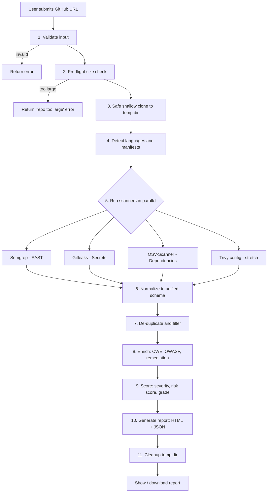

# workflow.md — RepoScan

How a scan flows from a GitHub URL to a finished report, plus the data contracts and rules each step follows.

---

## 1. End-to-End Flow



## 2. Step-by-Step

### Step 1 — Validate input
- Accept: `https://github.com/<owner>/<repo>[.git]` or `.../tree/<branch>`
- Regex: `^https://github\.com/[A-Za-z0-9_.-]+/[A-Za-z0-9_.-]+(\.git)?(/tree/[\w./-]+)?$`
- Reject everything else (other hosts, `file://`, `ssh://`, URLs with spaces/shell characters).
- Output: `owner`, `repo`, `branch | None`.

### Step 2 — Pre-flight size check
- Call `GET https://api.github.com/repos/{owner}/{repo}` (unauthenticated).
- Check: repo exists and is public, `size` (KB) under the cap (default 200 MB), not archived-empty.
- If the API is rate-limited, skip the check and rely on clone-time limits.

### Step 3 — Safe shallow clone
```bash
git -c core.hooksPath=/dev/null -c protocol.file.allow=never \
    clone --depth 1 --single-branch [--branch <branch>] \
    https://github.com/<owner>/<repo>.git /tmp/reposcan/<scan_id>/src
```
- Env: `GIT_TERMINAL_PROMPT=0`
- Timeout: 120 s
- Record: commit SHA (`git rev-parse HEAD`), branch, clone time.
- Post-clone guard: count files and total bytes; abort if over caps (e.g., 20,000 files).
- **Never** run build/install scripts from the repo.

### Step 4 — Detect languages and manifests
- Walk the tree (skip `.git`, `node_modules`, `vendor`, `dist`, `build`).
- Map extensions → languages (`.py`, `.js/.ts`, `.java`, `.go`, `.php`, `.rb`, …).
- Find dependency manifests: `requirements.txt`, `Pipfile.lock`, `poetry.lock`, `package-lock.json`, `yarn.lock`, `pnpm-lock.yaml`, `pom.xml`, `build.gradle`, `go.mod`, `Cargo.lock`, `composer.lock`, `Gemfile.lock`.
- Output: `languages[]`, `manifests[]`, LOC estimate. Used for the report summary and to choose Semgrep rulesets.

### Step 5 — Run scanners (parallel, isolated, time-boxed)

Each scanner implements the same interface:

```python
class Scanner:
    name: str
    def available(self) -> bool: ...          # binary installed?
    def run(self, src_dir: Path) -> RawResult: ...  # returns raw JSON or error
```

| Scanner | Command (example) | Timeout |
|---------|-------------------|---------|
| Semgrep | `semgrep scan --config p/security-audit --config p/owasp-top-ten --json --metrics=off --timeout 30 <src>` | 300 s |
| Gitleaks | `gitleaks detect --source <src> --no-git --report-format json --report-path out.json --redact` | 120 s |
| OSV-Scanner | `osv-scanner scan source -r --format json <src>` | 120 s |
| Trivy (stretch) | `trivy config --format json <src>` | 120 s |

Rules:
- Run with `subprocess.run([...], shell=False, capture_output=True, timeout=...)`.
- Use a thread pool (`concurrent.futures`) to run scanners concurrently.
- A scanner **failure, timeout, or missing binary never aborts the scan**. Record it in `scan_errors[]` and continue.
- Many scanners exit non-zero when findings exist; treat exit codes per tool, not blindly.

### Step 6 — Normalize to the unified schema

Every raw result is converted to a `Finding`:

```json
{
  "id": "SEMGREP-a1b2c3",
  "category": "sast | secret | dependency | misconfig",
  "title": "SQL injection via string concatenation",
  "severity": "critical | high | medium | low | info",
  "confidence": "high | medium | low",
  "file": "app/db.py",
  "line_start": 42,
  "line_end": 44,
  "snippet": "cursor.execute(\"SELECT * FROM users WHERE id=\" + user_id)",
  "description": "User input is concatenated into a SQL query...",
  "cwe": ["CWE-89"],
  "owasp": ["A03:2021 - Injection"],
  "rule_id": "python.lang.security.audit.formatted-sql-query",
  "tool": "semgrep",
  "remediation": "Use parameterized queries...",
  "references": ["https://owasp.org/www-community/attacks/SQL_Injection"],
  "package": null,
  "installed_version": null,
  "fixed_version": null,
  "advisory_ids": []
}
```

Dependency findings additionally fill `package`, `installed_version`, `fixed_version`, `advisory_ids` (CVE/GHSA), and use `file` = the manifest path.

Mapping notes:
- **Semgrep:** `extra.severity` (`ERROR/WARNING/INFO`) → `high/medium/low`; read `extra.metadata.cwe`, `owasp`, `confidence`.
- **Gitleaks:** all secrets default to `high`; private keys and cloud provider keys → `critical`. **Mask** `Secret` before it enters the schema (e.g., `AKIA••••MPLE`); the raw value is dropped.
- **OSV:** use CVSS score → severity (≥9 critical, 7–8.9 high, 4–6.9 medium, <4 low); take the lowest "fixed" version from the affected ranges.

### Step 7 — De-duplicate and filter
- Dedupe key: `(category, file, line_start, cwe or rule_id)`; for dependencies: `(package, installed_version, advisory_id)`.
- Merge duplicates, keep the highest severity, list all contributing tools.
- Drop findings in obvious noise paths by default (`tests/`, `docs/`, `examples/`, `*.min.js`, fixtures) **but** keep a count in the report ("N findings in test paths hidden").
- Secrets in test paths are *kept* but flagged `likely_test_data`.

### Step 8 — Enrich
- Attach CWE name/description and OWASP Top 10 category from a small local lookup table (`cwe_map.json`).
- Remediation: use a template per CWE (e.g., CWE-89 → parameterized queries). 
- **Optional LLM pass** (only if an API key/local model is configured):
  - Send only: rule title, 5–10 lines of snippet, language. **Never** send secrets or whole files.
  - Ask for: 2-sentence explanation + a fixed code snippet.
  - Cap at N=20 findings per scan (top severity first); cache by `rule_id + snippet hash`.
  - On any error → fall back to the template remediation.

### Step 9 — Score

Per-finding weight:

| Severity | Weight |
|----------|--------|
| Critical | 10 |
| High | 7 |
| Medium | 4 |
| Low | 1 |
| Info | 0 |

```
raw   = Σ weight(finding) × confidence_factor      # high=1.0, medium=0.7, low=0.4
score = min(100, round(raw))                        # 0 = clean, 100 = severe
```

| Score | Grade |
|-------|-------|
| 0–9 | A |
| 10–24 | B |
| 25–49 | C |
| 50–74 | D |
| 75–100 | F |

*(Tune thresholds after testing on a few repos; this is a simple heuristic, not a standard.)*

### Step 10 — Generate report

**Outputs** (in `reports/<owner>__<repo>__<timestamp>/`):
- `report.html` — self-contained (inline CSS/JS)
- `report.json` — full machine-readable result
- *(stretch)* `report.pdf`, `report.sarif`

**HTML report sections:**

1. **Header** — repo, branch, commit SHA, scan date, duration
2. **Executive summary** — risk score, grade, counts by severity, counts by category, languages detected
3. **Top priorities** — the 5 most important things to fix
4. **Findings** — grouped by category, sortable/filterable table; expandable row shows snippet, explanation, CWE/OWASP, remediation, links
5. **Vulnerable dependencies** — table with package, version, advisory IDs, fixed version, severity
6. **Secrets** — masked values, file/line, "rotate this credential" guidance
7. **Scan metadata** — tools + versions, rulesets, skipped paths, scanner errors, limitations
8. **Disclaimer** — automated scan; false positives possible; not a guarantee of security

### Step 11 — Cleanup
- `finally:` block removes the temp dir regardless of success or failure.
- Keep only the report folder (and optionally a SQLite row for history).

---

## 3. User Flows

### Web UI (Streamlit)
1. User pastes URL → clicks **Scan**
2. Progress steps appear: *Validating → Cloning → Scanning (Semgrep / Gitleaks / OSV) → Building report*
3. Summary card (score, grade, severity counts) displays inline
4. Buttons: **Download HTML**, **Download JSON**, expandable findings list

### CLI
```bash
reposcan scan https://github.com/OWASP/NodeGoat --out ./reports
reposcan scan https://github.com/owner/repo --branch dev --no-llm --only sast,secrets
reposcan --version
```
Exit codes: `0` clean/low only, `1` findings at/above `--fail-on` threshold, `2` scan error. (Handy for later CI use.)

---

## 4. Error Handling Matrix

| Situation | Behavior |
|-----------|----------|
| Invalid URL | Fail fast with a clear message |
| Repo private / not found | "Repo not found or private — only public repos are supported in this version" |
| Repo too large | Reject with size shown and the cap value |
| Clone timeout | Abort, cleanup, return error |
| One scanner crashes/times out | Continue; list under *Scan metadata → Errors* |
| All scanners fail | Return error report with diagnostics, exit code 2 |
| Zero findings | Still generate a report; show tools run and files scanned (proves the scan happened) |
| LLM unavailable | Fall back to template remediation silently, note in metadata |

---

## 5. Development Workflow

| Phase | Task | Done when |
|-------|------|-----------|
| 1 | `validator.py` + `cloner.py` with unit tests | Clones a public repo, rejects bad URLs, cleans up |
| 2 | `scanners/semgrep.py` | Raw JSON from a test repo is parsed |
| 3 | `scanners/gitleaks.py`, `scanners/osv.py` | All three return `Finding` objects |
| 4 | `normalize.py`, `dedupe.py`, `scoring.py` | Unified JSON output matches schema (Pydantic validation passes) |
| 5 | Report templates | HTML opens offline, filters work |
| 6 | CLI (`typer`) | `reposcan scan <url>` works end to end |
| 7 | Streamlit app | Same flow via browser |
| 8 | Dockerfile | `docker run` scans a repo with zero local setup |
| 9 | Validation | Test on vulnerable-by-design repos (see below) |
| 10 | README + demo recording | Another person can run it in < 5 minutes |

### Test repos (deliberately vulnerable)
- `juice-shop/juice-shop` (JS/TS)
- `OWASP/NodeGoat` (Node.js)
- `digininja/DVWA` (PHP)
- `WebGoat/WebGoat` (Java)
- `stamparm/DSVW` (small Python — good for fast iteration)
- `trufflesecurity/test_keys` (secrets detection)

### Testing checklist
- [ ] Unit tests: URL validator, normalizer (fixtures of raw scanner JSON), dedupe, scoring
- [ ] Integration test: scan a tiny fixture repo with one planted SQLi, one fake AWS key, one vulnerable dependency
- [ ] Malicious-input tests: bad URLs, shell metacharacters, huge repo, repo with symlinks
- [ ] Report test: HTML renders with zero findings and with 500+ findings

---

## 6. Guardrails (apply at every step)

1. Treat the cloned repo as **hostile input** — read it, never run it.
2. No `shell=True`; arguments always passed as lists.
3. Secrets are masked at the normalization step, so nothing downstream can leak them.
4. Every external call has a timeout.
5. Every scan gets a unique `scan_id` and its own temp dir.
6. Clean up in `finally`.
7. State limitations honestly in the report.
